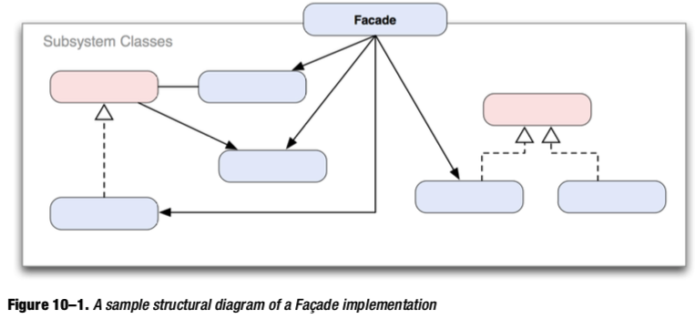
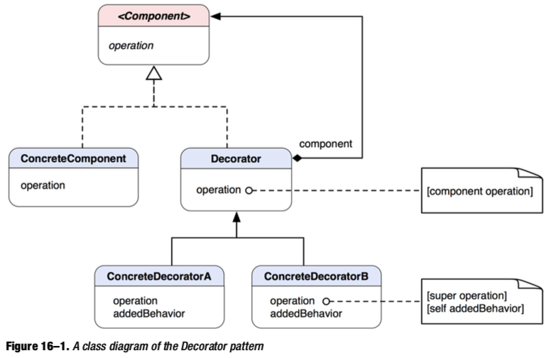

## 外观

为系统的一组接口对外提供一个统一的接口，使其更为易用




## 桥接

QYStatistic 大量散布在各个地方，能不能用chain responder

会员isVIP

##装饰 （Decorator）

动态的给一个对象添加额外的职责，而不破坏原有的风格 =》 加强版的类



直接拿图片上云扩展的方法来看装饰模式的优点

```objective-c
+ (void)loadForButton:(UIButton*)btn state:(UIControlState)stat imageName:(NSString*)imageName suffix:(NSString *)suffix autoScale:(BOOL)autoScale;
+ (void)loadForButtonBackground:(UIButton*)btn state:(UIControlState)stat imageName:(NSString*)imageName suffix:(NSString *)suffix autoScale:(BOOL)autoScale;
```

```objective-c
@interface UIButton (QYPlayerCloudImage)
-(void)setCloudImage:(NSString*)imageName state:(UIControlState)state autoScale:(BOOL)autoScale;
-(void)setCloudBackgroundImage:(NSString*)imageName state:(UIControlState)state autoScale:(BOOL)autoScale;
@end
```
```objective-c
btn = [[UIButton alloc] initWithFrame:CGRectZero];
[PlayerViewCommon loadForButton:btn state:UIControlStateNormal imageName:imgName suffix:@"png" autoScale:YES];
[PlayerViewCommon loadForButton:btn state:UIControlStateHighlighted imageName:imgName1 suffix:@"png" autoScale:YES];
[btn addTarget:self action:@selector(showVoteWebInfo:) forControlEvents:UIControlEventTouchUpInside];
```
```objective-c
_button = [[UIButton alloc] initWithFrame:CGRectZero];
[_button setCloudImage:imgName state:UIControlStateNormal autoScale:YES];
[_button setCloudImage:imgName1 state:UIControlStateHighlighted autoScale:YES];
[_button addTarget:self action:@selector(showVoteWebInfo:) forControlEvents:UIControlEventTouchUpInside];
```
## MVC