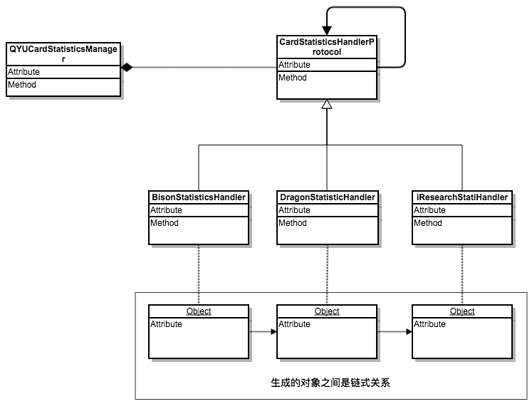

#常用设计模式

[Cocoa Fundamentals Guide](https://developer.apple.com/library/archive/documentation/Cocoa/Conceptual/CocoaFundamentals/CocoaDesignPatterns/CocoaDesignPatterns.html#//apple_ref/doc/uid/TP40002974-CH6-SW5)


##单例（Singleton）

最简单的设计模式，只能有一个实例，并且只能从为人熟知的访问点进行访问


####常见的单例模式代码

```objective-c
+ (Singleton *) sharedInstance {
if (sharedSingleton_ == nil) {
		sharedSingleton_ = [[Singleton alloc] init];
	}
	return sharedSingleton_; 
}
```

上面是一个没有线程安全的单例

####添加**线程安全**后的代码：

```objective-c
+(QYSingleton*)sharedQYSingleton
{
    static dispatch_once_t onceToken;
    dispatch_once(&onceToken, ^{
        _sharedSingleton = [[super allocWithZone:NULL] init];
    });
    return _sharedSingleton;
}
```

####单例模式需要考虑的其他问题

#####- ***是否允许创建单例类的其他实例***

  无论是类的提供方和使用方都应该考虑这个问题

  实际问题：奇秀直播播放器 ，我们提供的是单例，但是使用方是按照普通实例的方法用的，导致AudioSession 维护出错，数据流播放卡顿

  解决方案：

  1. 提供方对外暴露的文件要对使用方法有详细的注释说明，使用方在创建其他实例前要和提供方进行沟通

  2. 实现单例模式更严格的版本。alloc  和  copy 方法返回同一个实例

     ```objective-c
     +(id)allocWithZone:(struct _NSZone *)zone
     {
         return [self sharedQYSingleton];
     }
     
     -(id)copyWithZone:(NSZone *)zone
     {
         return self;
     }
     ```

#####- ***是否真的有必要使用单例模式***

  只能共享，不能复制的资源才有必要使用单例模式，否则会引起各种各样的问题，见播放器代码

  ```objective-c
  - (id)initWithFrame:(CGRect)frame andPlayerViewController:(QYPlayerViewController *)aPlayerViewController
  {
      self = [super initWithFrame:frame];
      if (self) {
          // Initialization code
          _playerViewController = aPlayerViewController;
      }
      return self;
  }
  ```

  之所以播放器基本所有类里面都会有对 QYPlayerViewController 的弱引用，就是因为播放器最初是以单例的方式存在的，对它的访问无处不在。所以在出现了播放器多实例之后，为了正常使用原先的方法，只能去访问它的实例变量（***新创建的类就不要传了***）。


1. 模块之间信息交流崩坏 
2. QYPlayerViewController 过度暴露--------移到类别------->类别里面的代码激增
3. 各业务模块耦合一起，难以独立 

拿controlView上的两个点击举例：

错误的使用方式 

```objective-c
- (void)freeFlowBtnClick {
    [_playerViewController showOrCloseNetReminderView:YES andMsg:[NSString string] fromType:MobileTrafficHint_UserClick];
}
```

推荐的使用方式

```objective-c
- (void)justLookAtHerClick {
    if (self.delegate && [self.delegate respondsToSelector:@selector(playerControl:object:)]) {
        if (self.delegate && [self.delegate respondsToSelector:@selector(playerControl:object:)]) {
           [self.delegate playerControl:PlayerView_JustLookAtHer object:nil];
           //TODO:参数怎么办 ？？？？？？？？？？？？？？？？？？？？？
        };
    }
}
```

```objective-c
//播放器内部事件
typedef NS_ENUM(NSInteger, QYPlayerAction) {
    QYPlayerAction_Back,              //返回
    QYPlayerAction_Download,          //缓存
    QYPlayerAction_Share,             //分享
};
```

其他方式：Block ： NSInvocation （代码增删查改调试）

##适配器（Adapter）

把一个类的接口转化为客户端希望的另一个接口


最常见的使用方式就是通过协议Protocols实现Delegate回调，但是Protocols更重要要的是 抽象行为  统一接口

例如我们在播放器里面加一个UI，除了本身业务，还需要考虑和其他模块的交互，最常见的设备本身

```objective-c
//设备相关操作
@protocol QYDeviceBehaviorProtocol <NSObject>
- (void) resignActive;//进入后台
- (void) becomeActive;//进入前台
- (void) netStatusChange:(NetworkStatus)status;//网络变化

- (void) playerWillChangeScreen:(PlayerScreenMode)mode;//转屏前处理
- (void) playerChangingScreen:(PlayerScreenMode)mode;//转屏中
- (void) playerDidChangedScreen:(PlayerScreenMode)mode;//转屏后
@end
```

以转屏为例

```objective-c
- (void)updatePannelControllerType:(PlayerScreenMode)aMode;//下半屏fullpannel
- (void)changeAdsScreenMode:(PlayerScreenMode)mode;//广告UI 
- (void)updateWaterFrameIsFullMode:(BOOL)isFull;//水印
```

目前存在的问题

1 方法不定，消息传递过程中名字变化多样


2 同一事件多个接口


3 方法不专用，非转屏也在调用转屏方法

// 播放器方法

## 工厂方法 （Abstract Factory ）

定义创建对象的接口，让子类决定实例化哪一个类。


要点在于不直接创建对象，而是使用类或者对象的工厂方法创建具体产品，工厂方法的变种之一

```objective-c
@interface NSNumber (NSNumberCreation)
+ (NSNumber *)numberWithChar:(char)value;
+ (NSNumber *)numberWithInt:(int)value;
+ (NSNumber *)numberWithLong:(long)value;
+ (NSNumber *)numberWithFloat:(float)value;
+ (NSNumber *)numberWithDouble:(double)value;
+ (NSNumber *)numberWithBool:(BOOL)value;
@end
```

我们的代码中有大量工厂模式的应用


但是奇怪的是只有三个及以上子类以上的类才会有人去用这个模式（QYPlayer），但代码里面最多的都是两个子类

而且都是为了区分pad和phone，当一个业务不需要区分pad和phone的时候，我们是没有去抽象的习惯的，甚至

```objective-c
@interface QYPlayControlView{
	QYMiniPlayControlBottomView *_phoneMiniControlView;//iphone 封装底部半屏控件层
	QYIpadMiniControlBottomView *_padMiniControlView;//ipad 封装底部半屏控件层
    
    QYFullPlayControlBottomView *_phoneFullControlView;//iphone 封装底部全屏控件层
	QYIpadFullControlBottomView *_padFullControlView;//ipad 封装底部全屏控件层
}
```

!bottom](./bottom.png)

```objective-c
@interface QYPlayControlView{
	QYMiniBottomView *_miniBottomControlView;//封装底部半屏控件层
    QYFullBottomView *_fullBottomControlView;//封装底部全屏控件层
}
```
行为抽象

```objective-c
@protocol QYFullPlayControlBottomViewDelegate <NSObject>
@protocol QYIpadMiniControlBottomViewDelegate <NSObject>
@protocol QYIpadFullControlBottomViewDelegate <NSObject>
@protocol QYMiniPlayControlBottomViewDelegate <NSObject>
    
- (void)progressChange:(QYProgressBar *)aProgressBar data:(NSDictionary *)aDic;
- (void)updateBroadcastViewIsShow:(QYProgressBar *)aProgressBar;
- (void)seekWithTouchTime:(CGFloat)time;

- (void)switchPlayOnOff:(id)sender;
- (void)doPipPlayer:(id)sender;
- (void)nextPlay:(id)sender;
- (void)episodeClick:(id)sender;
- (void)clarityClick:(id)sender;
- (void)soundOnOff:(UIButton *)sender;
- (void)multiPlayAct:(id)sender state:(NSInteger)state;
- (void)soundTrackBtnClicked:(id)sender;
- (void)videoCut:(id)sender;
- (double)durationRemovePreAds;
- (void)justLookAtHerClick;

@end
```

进度更改 + 事件点击

```objective-c
@protocol QYBottomViewDelegate <NSObject>

- (void)progressChange:(QYProgressBar *)aProgressBar data:(NSDictionary *)aDic;
- (void)updateBroadcastViewIsShow:(QYProgressBar *)aProgressBar;
- (void)seekWithTouchTime:(CGFloat)time;

- (void)handleBottomViewClickEvent:(PlayerTopViewEventType)type sender:(UIView *)aView;

@end

@protocol QYIpadFullControlBottomViewDelegate<QYBottomViewDelegate>
    //something new
    //TODO:每个子类都有个性处理，而且个性处理远多于通用处理
@end
```
## 责任链


```objective-c
@interface QYUCardStatisticsManager : NSObject
    QYUBisonStatisticsHandler*  bisonStatisticsHandler;
    QYUDragonStatisticsHandler*  dragonStatisticsHandler;
	QYUIResearchStatisticsHandler*  iresearchStatisticsHandler;
@end

- (void)handleShowCardData:(QYCardData *)cardData{
    [bisonStatisticsHandler handleShowCardData:cardData];
    [dragonStatisticsHandler handleShowCardData:cardData];
    [iresearchStatisticsHandler handleShowCardData:cardData];
}
```

```objective-c
@interface QYUCardStatisticsManager : NSObject
    id<QYUCardStatisticsHandlerProtocol> cardStatisticsHandler;
	- (void)registerHander:(id<QYUCardStatisticsHandlerProtocol>)hander;
@end
- (void)handleShowCardData:(QYCardData *)cardData{
    [cardStatisticsHandler handleShowCardData:cardData];
}
```
两种写法的类图：




------
##中介者

用一个对象来封装一系列对象的交互方式，使各对象不需要显式的相互引用，从而使耦合松散


中介者就是以耦合来解决耦合，可以解决QYPlayerViewController里面category代码过多的问题

使得QYPlayerViewController内部代码只处理对外暴露的业务

