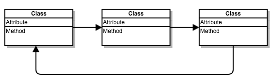
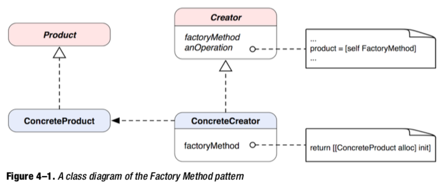

#常用设计模式

[Cocoa Fundamentals Guide](https://developer.apple.com/library/archive/documentation/Cocoa/Conceptual/CocoaFundamentals/CocoaDesignPatterns/CocoaDesignPatterns.html#//apple_ref/doc/uid/TP40002974-CH6-SW5)


##单例（Singleton）

最简单的设计模式，只能有一个实例，并且只能从为人熟知的访问点进行访问

####常见的单例模式代码

```objective-c
+ (Singleton *) sharedInstance {
if (sharedSingleton_ == nil) {
		sharedSingleton_ = [[Singleton alloc] init];
	}
	return sharedSingleton_; 
}
```

上面是一个没有线程安全的单例

####添加**线程安全**后的代码：

```objective-c
+(QYSingleton*)sharedQYSingleton
{
    static dispatch_once_t onceToken;
    dispatch_once(&onceToken, ^{
        _sharedSingleton = [[super allocWithZone:NULL] init];
    });
    return _sharedSingleton;
}
```

####单例模式需要考虑的其他问题

#####- ***是否允许创建单例类的其他实例***

  无论是类的提供方和使用方都应该考虑这个问题

  实际问题：奇秀直播播放器 ，我们提供的是单例，但是使用方是按照普通实例的方法用的，导致AudioSession 维护出错，数据流播放卡顿

  解决方案：

  1. 提供方对外暴露的文件要对使用方法有详细的注释说明，使用方在创建其他实例前要和提供方进行沟通

  2. 实现单例模式更严格的版本。alloc  和  copy 方法返回同一个实例

     ```objective-c
     +(id)allocWithZone:(struct _NSZone *)zone
     {
         return [self sharedQYSingleton];
     }
     
     -(id)copyWithZone:(NSZone *)zone
     {
         return self;
     }
     ```

#####- ***是否真的有必要使用单例模式***

  只能共享，不能复制的资源才有必要使用单例模式，否则会引起各种各样的问题，见播放器代码

  ```objective-c
  - (id)initWithFrame:(CGRect)frame andPlayerViewController:(QYPlayerViewController *)aPlayerViewController
  {
      self = [super initWithFrame:frame];
      if (self) {
          // Initialization code
          _playerViewController = aPlayerViewController;
      }
      return self;
  }
  ```

  之所以播放器基本所有类里面都会有对 QYPlayerViewController 的弱引用，就是因为播放器最初是以单例的方式存在的，对它的访问无处不在。所以在出现了播放器多实例之后，为了正常使用原先的方法，只能去访问它的实例变量（***新创建的类就不要传了***）。



1. 模块之间信息交流崩坏
2. QYPlayerViewController 过度暴露
3. 各业务模块耦合一起

拿controlView上的两个点击举例：

错误的使用方式 

```objective-c
- (void)freeFlowBtnClick {
    [_playerViewController showOrCloseNetReminderView:YES andMsg:[NSString string] fromType:MobileTrafficHint_UserClick];
}
```

正确的使用方式

```objective-c
- (void)justLookAtHerClick {
    if (self.delegate && [self.delegate respondsToSelector:@selector(playerControl:object:)]) {
        if (self.delegate && [self.delegate respondsToSelector:@selector(playerControl:object:)]) {
            [self.delegate playerControl:PlayerView_JustLookAtHer object:nil];
        };
    }
}
```

```objective-c
//播放器内部事件
typedef NS_ENUM(NSInteger, QYPlayerAction) {
    QYPlayerAction_Back,              //返回
    QYPlayerAction_Download,          //缓存
    QYPlayerAction_Share,             //分享
};
```

##适配器（Adapter）

把一个类的接口转化为客户端希望的另一个接口，最常见的使用方式就是通过协议Protocols实现Delegate回调

但是Protocols更重要要的是 抽象行为 和 统一接口

例如我们在播放器里面加一个UI，除了本身业务，还需要考虑和其他模块的交互，最常见的设备本身

```objective-c
//设备相关操作
@protocol QYDeviceBehaviorProtocol <NSObject>
- (void) resignActive;//进入后台
- (void) becomeActive;//进入前台
- (void) playerWillChangeScreen:(PlayerScreenMode)mode;//转屏前处理
- (void) playerChangingScreen:(PlayerScreenMode)mode;//转屏中
- (void) playerDidChangedScreen:(PlayerScreenMode)mode;//转屏后
- (void) netStatusChange:(NetworkStatus)status;//网络变化
@end
```

目前

```objective-c
- (void)updatePannelControllerType:(PlayerScreenMode)aMode;//下半屏fullpannel
- (void)changeAdsScreenMode:(PlayerScreenMode)mode;//广告UI 
- (void)updateWaterFrameIsFullMode:(BOOL)isFull;//水印
```

目前存在两个问题


## 工厂方法 （Abstract Factory ）

定义创建对象的接口，让子类决定实例化哪一个类。



要点在于不直接创建对象，而是使用类或者对象的工厂方法创建具体产品，工厂方法的变种之一

```objective-c
@interface NSNumber (NSNumberCreation)
+ (NSNumber *)numberWithChar:(char)value;
+ (NSNumber *)numberWithInt:(int)value;
+ (NSNumber *)numberWithLong:(long)value;
+ (NSNumber *)numberWithFloat:(float)value;
+ (NSNumber *)numberWithDouble:(double)value;
+ (NSNumber *)numberWithBool:(BOOL)value;
@end
```

我发现咱们的代码中有很多工厂模式的应用

```objective-c
@interface QYAdBadgeFactory : NSObject
+(UIView*)pauseADBadge;//暂停
+(UIView*)commonOverlayBadge;//通用浮层
+(UIView*)viewPointOverlayBadge;//随视购-视点广告
+(UIView*)viewPointListBadge;//随视购-视点广告 列表
@end
```
但是奇怪的是只有三个及以上子类以上的类才会有人去用这个模式（QYPlayer）

```objective-c
@interface QYPlayControlView{
	QYMiniPlayControlBottomView *_phoneMiniControlView;//iphone 封装底部半屏控件层
	QYIpadMiniControlBottomView *_padMiniControlView;//ipad 封装底部半屏控件层
    
    QYFullPlayControlBottomView *_phoneFullControlView;//iphone 封装底部全屏控件层
	QYIpadFullControlBottomView *_padFullControlView;//ipad 封装底部全屏控件层
}
```


```objective-c
@interface QYPlayControlView{
	QYMiniBottomView *_miniBottomControlView;//封装底部半屏控件层
    QYFullBottomView *_fullBottomControlView;//封装底部全屏控件层
}
```


##装饰 （Decorator）

动态的给一个对象添加额外的职责，而不破坏原有的风格 =》 加强版的类

直接拿图片上云扩展的方法来看装饰模式的优点

```objective-c
+ (void)loadForButton:(UIButton*)btn state:(UIControlState)stat imageName:(NSString*)imageName suffix:(NSString *)suffix autoScale:(BOOL)autoScale;
+ (void)loadForButtonBackground:(UIButton*)btn state:(UIControlState)stat imageName:(NSString*)imageName suffix:(NSString *)suffix autoScale:(BOOL)autoScale;
```

```objective-c
@interface UIButton (QYPlayerCloudImage)
-(void)setCloudImage:(NSString*)imageName state:(UIControlState)state autoScale:(BOOL)autoScale;
-(void)setCloudBackgroundImage:(NSString*)imageName state:(UIControlState)state autoScale:(BOOL)autoScale;
@end
```
```objective-c
btn = [[UIButton alloc] initWithFrame:CGRectZero];
[PlayerViewCommon loadForButton:btn state:UIControlStateNormal imageName:imgName suffix:@"png" autoScale:YES];
[PlayerViewCommon loadForButton:btn state:UIControlStateHighlighted imageName:imgName1 suffix:@"png" autoScale:YES];
[btn addTarget:self action:@selector(showVoteWebInfo:) forControlEvents:UIControlEventTouchUpInside];
```
```objective-c
_button = [[UIButton alloc] initWithFrame:CGRectZero];
[_button setCloudImage:imgName state:UIControlStateNormal autoScale:YES];
[_button setCloudImage:imgName1 state:UIControlStateHighlighted autoScale:YES];
[_button addTarget:self action:@selector(showVoteWebInfo:) forControlEvents:UIControlEventTouchUpInside];
```


## 再谈MVC


